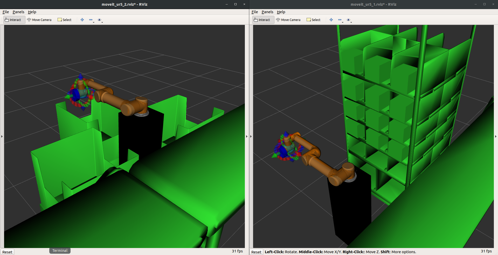

====
rviz
====
Holds the :ref:`scene files <scene-file>` for the two UR5 RViz Planning Scenes.

   The two RViz Planning Scenes.

The planning scenes are called to the environment in the :doc:`launch file <../launch/task5_solution>`:

.. code-block:: xml

   <!-- Add scene files to Moveit! Planning Scenes in RViz -->
   <!-- Scene for UR5 Shelf Picker -->
   <group ns="ur5_1">
      <arg name="scene_file" default="$(find pkg_task5)/config/rviz/UR5_1_Shelf.scene"/>
      <node name = "moveit_publish_scene_from_text" pkg= "moveit_ros_planning" type="moveit_publish_scene_from_text" args= "$(arg scene_file)"/>
   </group>
   <!-- Scene for UR5 Bin Sorter -->
   <group ns="ur5_2">
      <arg name="scene_file" default="$(find pkg_task5)/config/rviz/UR5_2_Bins.scene"/>
      <node name = "moveit_publish_scene_from_text" pkg= "moveit_ros_planning" type="moveit_publish_scene_from_text" args= "$(arg scene_file)"/>
   </group>

