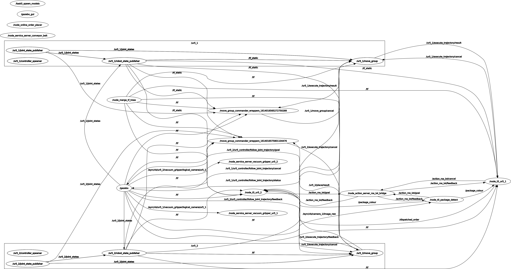
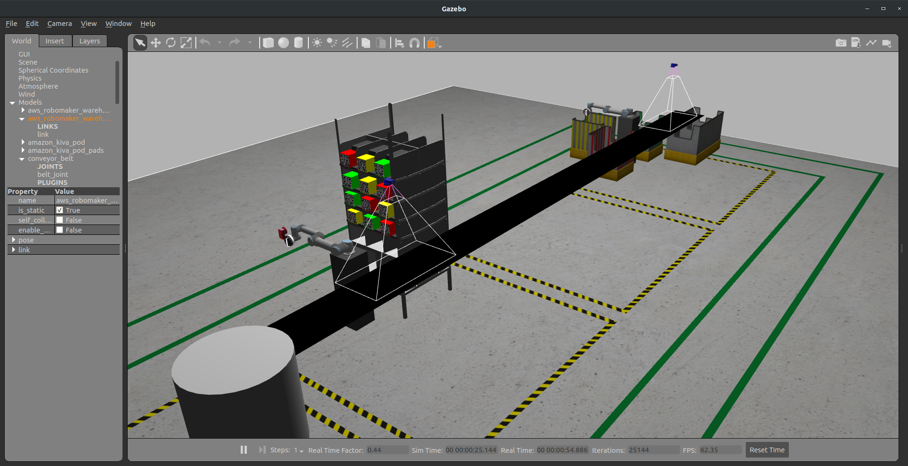
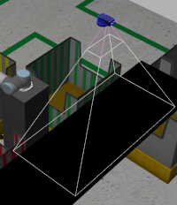
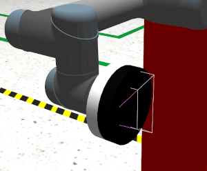

==============
ROS and Gazebo
==============

The ROS + Gazebo setup is the core of this implementation, controlling the majority of code execution during the course of performing the task.

----

ROS
***
.. figure:: Images/ROS\ Terminal.png
   :align: center

   The ROS nodes for the arms in action inside the terminal.

Robot Operating System (ROS) is a middleware that interconnects many different sensors, robots, etc. as nodes in a control network, and helps maintain communication pipelines and control between the nodes, thus providing a robust modeling and control system for robotics applications. 

Through encapsulated modular packages, each containing one or multiple nodes that are run through Python scripts that are collectively executed through launch files in each package, nodes can access configuration files containing formats to send signals to other nodes under, or preloaded data to access during execution, etc. The entire hierarchy and mapping of the ROS system implemented in this task can be summarised thus:

   The `rqt_graph`_ containing a mapping of all the ROS nodes used in the implementation.

.. _`rqt_graph`: http://wiki.ros.org/rqt_graph

----

Gazebo
******

   The Gazebo environment provided for the task.

Gazebo is the primary simulation environment for ROS applications that integrates neatly with the other mainstream systems like MoveIt! and RViz, both essential resources for this implementation. The environment for this task was already provided.

.. _LogicalCamera:

Logical Camera
--------------

   The logical camera on the conveyor near the UR5_2.

The logical camera is a simulation concept that mimics a collision-detecting setup of `multiple cameras`_ in the real world. While a camera outputs an image (or ``<visual>`` geometry). a logical camera outputs ``<collision>``, by checking whether the frustrum of the FOV (Field Of View) projected by the camera `intersects the axis`_ of the model being detected. The output of the logical camera can then be used to detect the :ref:`frame of the object in RViz <TFframe>` for the UR5 to travel towards to execute the pick operation.

.. code-block:: xml
   :caption: An example output by the logical camera.

   models: 
   - 
     type: "packagen1"
     pose: 
       position: 
         x: 1.00500025103
         y: 3.69889668792e-11
         z: 3.69157426527e-06
       orientation: 
         x: -0.707108079852
         y: -1.54975566534e-10
         z: -1.54852058667e-10
         w: 0.707105482519

.. _`multiple cameras`: https://medium.com/androiddevelopers/getting-the-most-from-the-new-multi-camera-api-5155fb3d77d9
.. _`intersects the axis`: http://gazebosim.org/tutorials?tut=logical_camera_sensor&cat=sensors#DataExplanation

Vacuum Gripper
--------------

   The vocuum gripper with the embedded logical camera.

The vacuum gripper on the UR5s provided for the task have their own logical camera embedded inside, that will allow the gripper to be activated only if a package is within range of the gripper; i.e, nothing other than a designated package can be picked up by the gripper.
